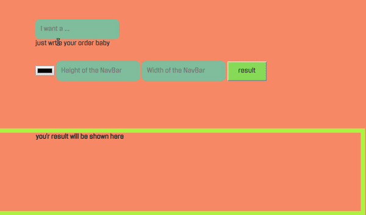

TexCode  👻
=======

this idea came from **nothing** so just take it as a practice

### TexCode is a translator which translate text and make an static code snippet

**this is an idea not an real application (until now ) lets start coding**  

#### How does it work

_its simple as not to star this repo_  
  
  
just write your your order baby  
  
  
  

yo now its still just for navbars so don't be tough at him
----------------------------------------------------------

##### i will add more awesome features to but not today

[find me on instagram](www.instagram.com/zzaaaiiid1)
